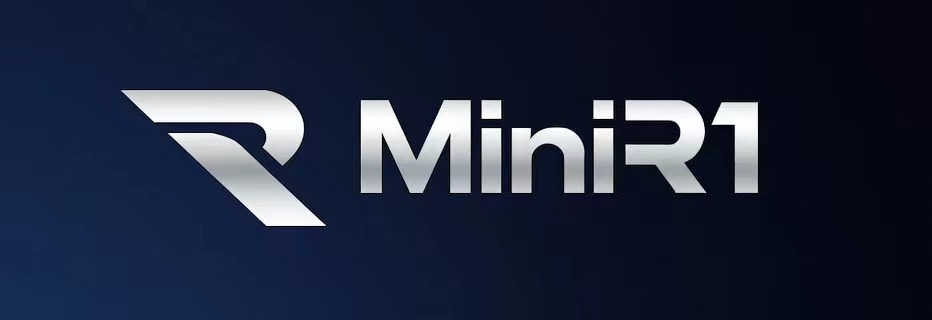
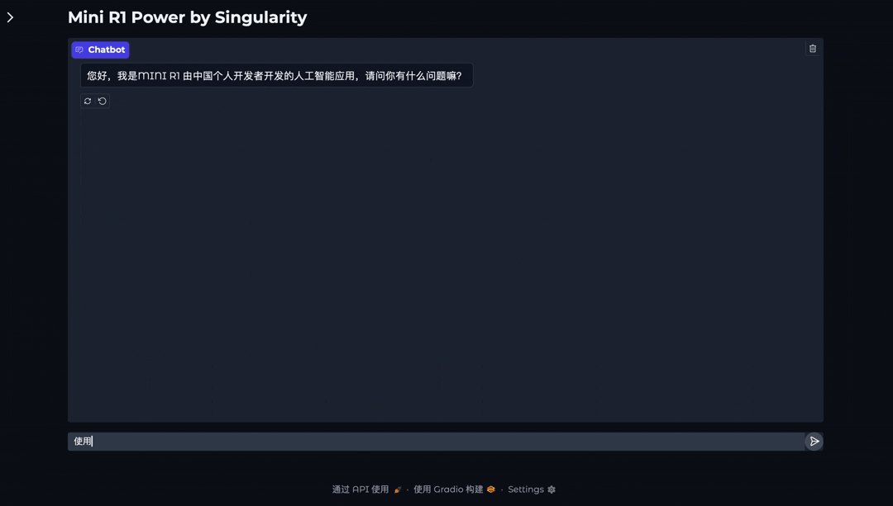

<div align="center">



</div>

<div align="center">


[](https://github.com/Singularity-M/mini-r1/stargazers)
[](LICENSE)
[](https://github.com/Singularity-M/mini-r1/commits/master)
[](https://github.com/Singularity-M/mini-r1/pulls)

</div>

<div align="center">
  <h3>"无论是深入研究者，还是初学者，本项目都是进入LLM领域的绝佳切入点！"</h3>
</div>

### 📌 项目简介  

本项目完整覆盖了从**数据清洗**到**大语言模型(LLM)训练**的全流程，100%基于**PyTorch** 从零实现，纯净透明，无任何第三方高阶封装。

核心优势包括：

- 数据清洗包括去重、格式规范化等步骤，确保高质量输入数据。  
- 训练过程涵盖 **预训练（Pretrain）、监督微调（SFT）、强化学习（GPRO）、知识蒸馏（Distillation）、LoRA 微调** 等完整流程。
- 本项目所开源的GRPO训练代码适合快速上手和本地适配。
- 代码完全基于 **PyTorch** 从零实现，避免黑盒封装，适合研究和深入理解 LLM 训练。 

---

<div align="center">



</div>


### 📌 关键特性  

💡 **数据清洗**
- 提供完整数据清理与预处理代码，确保输入数据高质量
- 采用jsonl格式，支持多源数据整合
- 缺失值处理、去重与格式规范化，确保数据一致性与准确性

🛠 **完整训练流程**
- **预训练(Pretrain)**：基于大规模语料的无监督训练，掌握基础语言知识
- **监督微调(SFT)**：利用高质量问答数据，显著提升模型对话能力
- **强化学习(DPO)**：通过偏好数据优化模型输出，贴合实际人类需求
- **强化学习(GRPO)**：全网最易懂的deepseek GRPO代码复现
- **LoRA微调**：低秩适配技术，高效适应特定领域知识

🚀 **100% PyTorch实现**
- 纯PyTorch代码实现，透明易懂，无HuggingFace等第三方高阶封装
- 深入理解LLM训练机制的绝佳选择，适合研究和学习
- 支持单卡、多卡(DDP/DeepSpeed)训练，可轻松扩展到更大规模
---

### 📌 快速上手  

#### **1️⃣ 环境准备**

```bash
git clone https://github.com/Singularity-M/mini-r1.git
cd mini-r1
pip install -r requirements.txt
```

#### **2️⃣ 数据准备**  
从下文提供的[数据集下载链接](https://www.modelscope.cn/datasets/math0205/MINIR1/files)
- 下载清洗后的数据集，并放入 `./data/` 目录。 
- 预训练数据 (`pretrain.jsonl`)、微调数据 (`sft.jsonl`)、强化学习数据 (`grpo.jsonl`)。

#### **3️⃣ 训练步骤**  

✅ **预训练** (Pretrain)  
```bash
python train_pretrain.py
```

✅ **监督微调** (SFT)  
```bash
python train_sft.py
```

✅ **强化学习（DPO）**  
```bash
python train_dpo.py
```

✅ **知识蒸馏** (Distillation)  
```bash
python train_distill.py
```

✅ **LoRA 微调**  
```bash
python train_lora.py
```

✅ **评估测试**  
```bash
python eval_model.py
```

---

### 📌 模型结构  

本项目基于 **Transformer Decoder-Only** 结构，并做了以下优化：  

- **使用 `RMSNorm`** 进行归一化，替代传统的 LayerNorm。  
- **采用 `SwiGLU` 激活函数**，提升训练稳定性。  
- **支持 `RoPE 位置编码`**，增强长文本建模能力。  
- **支持 `Dense` 和 `MoE`（混合专家）两种架构**，适应不同计算需求。  

待补充图片：  
📌 **[Transformer 架构图]**  
📌 **[MoE 结构示意图]**  

---

### 📌 参考与致谢  

本项目受到 **[MiniMind](https://github.com/jingyaogong/minimind)** 启发，感谢其开源的训练思路和实现方式。  
希望本项目也能为更多人提供 **简洁、完整、100% PyTorch** 的 LLM 训练示例。  

🚀 **欢迎 Star & PR！**
